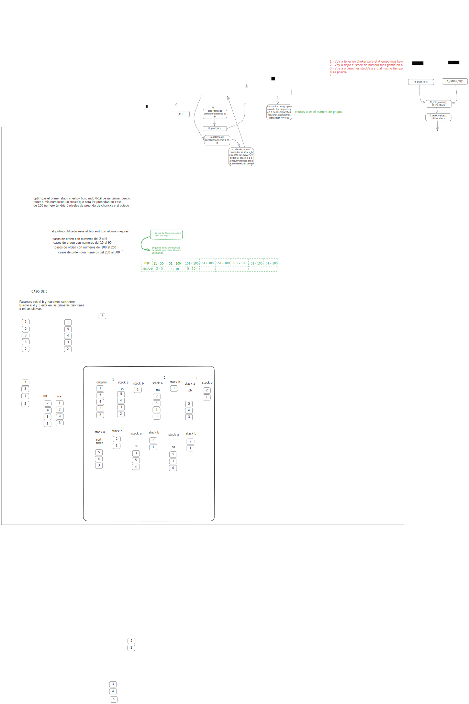

<h1 class="title">Push Swap algorithm</h1>

### **Detailed Flowchart of the Push Swap Algorithm**

#### **1. Start**
   - Begin the program.

#### **2. Validate Input Data**
   - Check if the input arguments are valid:
     - Are there non-numeric characters?
     - Are there duplicate numbers?
     - Are the numbers within the range of an integer (`INT_MIN` to `INT_MAX`)?
   - If there are errors:
     - Print an error message (e.g., "Error").
     - Terminate the program.
   - If the input is valid, proceed.

#### **3. Create Stack A**
   - Convert the input arguments into a **circular doubly linked list** (Stack A).
   - Assign an **index** to each element based on its value (e.g., the smallest number gets index 0, the next smallest gets index 1, etc.).
   - Divide the stack into **chunks** (groups) for optimization.

#### **4. Check if Stack A is Sorted**
   - Traverse Stack A to check if it is already sorted in ascending order.
   - If Stack A is sorted:
     - Terminate the program.
   - If Stack A is not sorted:
     - Proceed to the sorting algorithm.

#### **5. Sort Stack A**
   - **Case 1: Small Stack (3 elements or fewer)**
     - Use a specific algorithm to sort 2 or 3 elements (e.g., `sort_three`).
   - **Case 2: Medium Stack (4 to 6 elements)**
     - Use specific functions to sort 4, 5, or 6 elements (e.g., `sort_four`, `sort_five`, `sort_six`).
   - **Case 3: Large Stack (more than 6 elements)**
     - Divide Stack A into **chunks** (groups).
     - Push elements from Stack A to Stack B in an optimized way (e.g., push smaller elements first).
     - Sort Stack B.
     - Push elements back from Stack B to Stack A in ascending order.

#### **6. Optimize Movements**
   - Calculate the **cost** of moving elements between Stack A and Stack B:
     - Determine the number of rotations (`ra`, `rb`, `rra`, `rrb`) needed to position elements correctly.
   - Use **swap operations** (`sa`, `sb`) when necessary to minimize the number of moves.
   - Combine rotations when possible (e.g., `rr` for rotating both stacks simultaneously).

#### **7. Push Elements Back to Stack A**
   - Find the **best element** in Stack B to push back to Stack A.
   - Calculate the cost of moving the element to the top of Stack B and then to Stack A.
   - Perform the necessary rotations and pushes (`pa`) to move the element.

#### **8. Finalize Sorting**
   - After all elements are pushed back to Stack A:
     - Check if Stack A is fully sorted.
     - If not, perform additional rotations or swaps to fix the order.

#### **9. End**
   - Print the sorted Stack A (optional).
   - Free the memory allocated for the stacks.
   - Terminate the program.

---

### **Detailed Flowchart Representation**

```
+-------------------+
|      Start         |
+-------------------+
          |
          v
+-------------------+
| Validate Input     |
| - Check for errors |
| - Handle errors    |
+-------------------+
          |
          v
+-------------------+
| Create Stack A     |
| - Convert input    |
| - Assign indices   |
| - Divide chunks    |
+-------------------+
          |
          v
+-------------------+
| Is Stack A sorted? |
+-------------------+
          |
          v
+-------------------+
| Sort Stack A       |
| - Small stack?     |
| - Medium stack?    |
| - Large stack?     |
+-------------------+
          |
          v
+-------------------+
| Optimize Movements |
| - Calculate cost   |
| - Rotate & swap    |
+-------------------+
          |
          v
+-------------------+
| Push to Stack A    |
| - Find best element|
| - Push & rotate    |
+-------------------+
          |
          v
+-------------------+
| Finalize Sorting   |
| - Check order      |
| - Fix if needed    |
+-------------------+
          |
          v
+-------------------+
|      End           |
+-------------------+
```

---

### **Key Functions and Their Roles**

1. **Input Validation**
   - `ft_thera_are_error`: Checks for errors in input arguments.
   - `ft_no_repeat`: Ensures there are no duplicate numbers.

2. **Stack Creation**
   - `ft_create_value`: Creates a new node for the stack.
   - `ft_add_back_the_list`: Adds a node to the end of the stack.
   - `create_a_new_list`: Converts input arguments into Stack A.

3. **Sorting**
   - `sort_three`: Sorts a stack of 3 elements.
   - `sort_four`, `sort_five`, `sort_six`: Sort stacks of 4, 5, or 6 elements.
   - `pass_group_to_b`: Pushes elements from Stack A to Stack B in chunks.
   - `optimize_and_push`: Optimizes the movement of elements between stacks.

4. **Optimization**
   - `calculate_cost`: Determines the cost of rotating elements.
   - `find_best_element`: Finds the best element to move.

5. **Finalization**
   - `sorted`: Checks if the stack is sorted.
   - `free_stack`: Frees the memory allocated for the stacks.

---